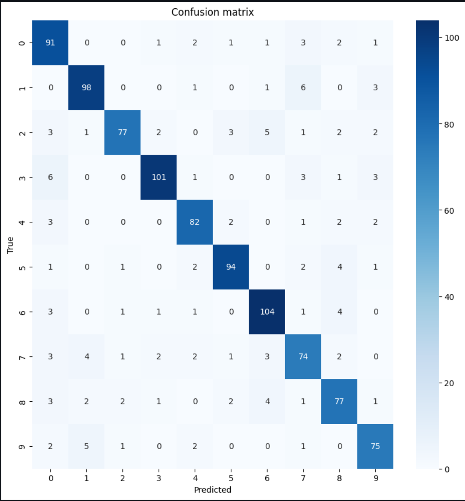

# Things I have learnt from Q2 of the Assignment
This post will detail the things that I learnt when doing Question 2 of this assignment

Q2 of the assignment allowed me to understand and put into practice convolutional neural networks using fastAi's library.
The most valuable techniques I learnt include:
* using duckduckgo_search library to scrape and download images for dataset creation
* exploring how fastAI's models are created
* how a pretrained model (like Resnet18) can be easily implemented on a dataset
* how to generate and interperet a confusion matrix of the models performance to determine the effectiveness of the model
* how to generate a T-SNE graph to analyse how each class of images diverges from each other in the feature space

My attempt at extending fastAI's binary image classifier project to work for 10 animal classes was successful, yielding a 86.64% accuracy and a confusion matrix (below) that indicates the model is classifying images to their correct class the vast majority of the time.

