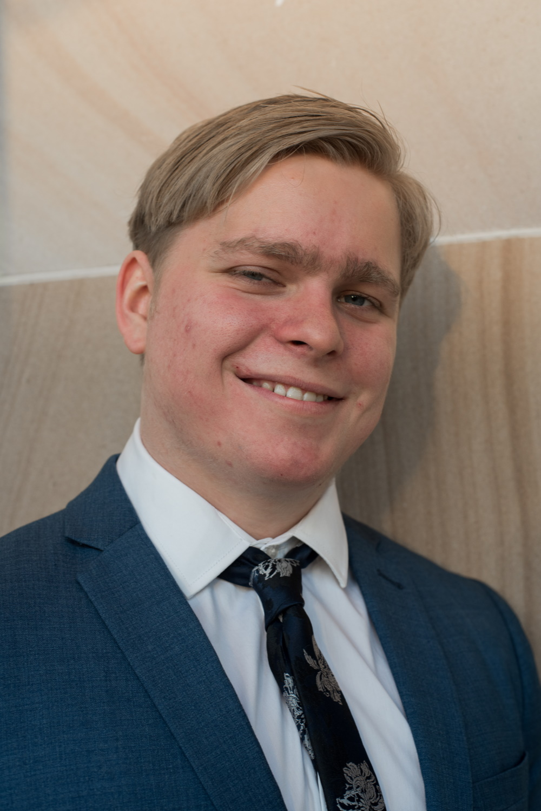

Hello! My name is Kaia and I am in my third year of my Computer Science Course at UQ majoring in machine learning. I have been interested in coding ever since I was 10 years old. I even used to go to the local library on saturday's when I was younger to do game development coding courses in Unity with C#. Since then I have vastly improved my coding skills and have taken a new interest in deep learning and all things machine learning. It is crazy to think that right now, Artificial Intelligence is the the worst it will ever be. I cannot wait to see what the future holds for the field of AI!

## FastAI Course

I have created numerous posts on important lessons I have learnt from the [fast.ai course](https://www.fast.ai). These posts will document my learning journey in the field of AI. This is a test update.
